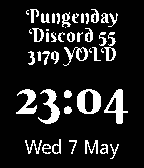

pebble-discordian
=================

Pebble watch face that displays the current
[Discordian](https://en.wikipedia.org/wiki/Discordianism) date. Fnord!

Build status: 

Link to latest successfully built app bundle as soon as the spectacularly
awesome [CloudPebble](http://cloudpebble.net) supports it.

License
-------

The code uses the MIT license. See the LICENSE file for details.

Two third-party fonts (Droid Sans and Berkshire Swash) are also distributed
with this project, each with their own license. See the individual directories
in `resources/src/fonts/` for details.

Making it work
--------------

You'll need to have the [pebble SDK](http://developer.getpebble.com/)
installed.

After cloning the repository, set up the SDK framework by running the following
command from the directory containing the repository:

    pebble_sdk_path=/path/to/pebble-sdk-release-001
    ${pebble_sdk_path}/tools/create_pebble_project.py ${pebble_sdk_path}/sdk/ \
        pebble-discordian --symlink-only

Then change into the repository and configure and build:

    cd pebble-discordian
    ./waf configure
    ./waf build

Follow instructions from the SDK documentation to install the watch face onto
your wrist.

TODO
----

 * Named holidays instead of dates.

Bugs and issues
---------------

There are no other known bugs, because I haven't figured out how to write unit
tests for Pebble projects.

Some of the code (mostly building strings) is a bit convoluted due to
limitations in the runtime environment that preclude certain operations.
